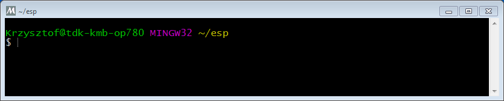

***************************************
Windows 平台工具链的标准设置
***************************************

引言
============

Windows 没有内置的 "make" 环境，因此如果要安装工具链，你需要一个 GNU-兼容 环境。我们这里使用 MSYS2_ 来提供该环境。你可能不需要一直使用这个环境（你可以使用 :doc:`Eclipse <eclipse-setup>` 或其它前段工具），但是它在你的屏幕后面隐藏着。

工具链的设置
===============

<<<<<<< HEAD
快速设置的方法是从 dl.espressif.com 下载集成在一起的工具链 & MSYS zip 压缩文件：
=======
The quick setup is to download the Windows all-in-one toolchain & MSYS2 zip file from dl.espressif.com:
>>>>>>> master

https://dl.espressif.com/dl/esp32_win32_msys2_environment_and_toolchain-20180110.zip

将 zip 压缩文件解压到 ``C:\`` (或其它路径，但是这里假设解压缩到 ``C:\``)，它会使用预先准备的环境创建一个 ``msys32`` 目录。

检出
============

<<<<<<< HEAD
运行 ``C:\msys32\mingw32.exe`` 可以打开 MSYS2 的终端窗口。该窗口的环境是一个 bash shell。
=======
Open a MSYS2 MINGW32 terminal window by running ``C:\msys32\mingw32.exe``. The environment in this window is a bash shell. 
>>>>>>> master

<<<<<<< HEAD
    MSYS2 终端窗口
=======
    MSYS2 MINGW32 shell window

Use this window in the following steps setting up development environment for ESP32.
>>>>>>> master

后续步骤将会使用这个窗口来为 ESP32 设置开发环境。

后续步骤
==========

要继续设置开发环境，请参考 :ref:`get-started-get-esp-idf` 一节。

Updating The Environment
========================

When IDF is updated, sometimes new toolchains are required or new requirements are added to the Windows MSYS2 environment. To move any data from an old version of the precompiled environment to a new one:

- Take the old MSYS2 environment (ie ``C:\msys32``) and move/rename it to a different directory (ie ``C:\msys32_old``).
- Download the new precompiled environment using the steps above.
- Unzip the new MSYS2 environment to ``C:\msys32`` (or another location).
- Find the old ``C:\msys32_old\home`` directory and move this into ``C:\msys32``.
- You can now delete the ``C:\msys32_old`` directory if you no longer need it.

You can have independent different MSYS2 environments on your system, as long as they are in different directories.

There are :ref:`also steps to update the existing environment without downloading a new one <updating-existing-windows-environment>`, although this is more complex.

相关文档
=================

.. toctree::
    :maxdepth: 1

    windows-setup-scratch

.. _MSYS2: https://msys2.github.io/
